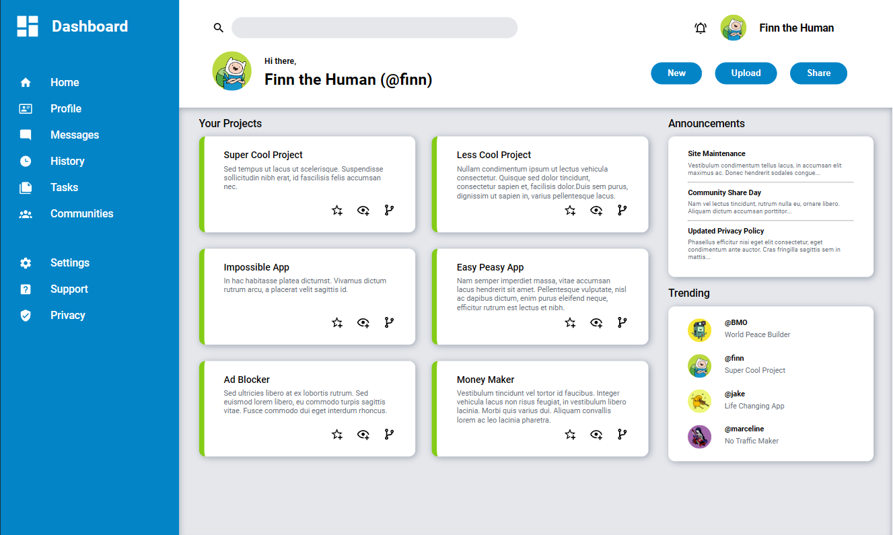

# Admin-Dashboard

This project is based on [Project: Admin Dashboard](https://www.theodinproject.com/lessons/node-path-intermediate-html-and-css-admin-dashboard) of The odin Project.  

Live Preview [here]().  

  

### Goal

The project DASHBOARD showcases the use of GRID. Although flexbox will appear here and there, the main layout
for this project is still GRID. The dashboard also uses [TailwindCSS](https://tailwindcss.com/docs/customizing-colors) for color palletes and  icons at [Material Design Icons](https://pictogrammers.com/library/mdi/).

### Credit

Credits to WallpaperClan in reddit for the free Adventure Time icons used in this project.  
Why Adventure Time?, cause hey! this are good pictures 😊. 

### Technologies

Built with HTML, CSS, TailwindCSS, and Material Desing Icons.

